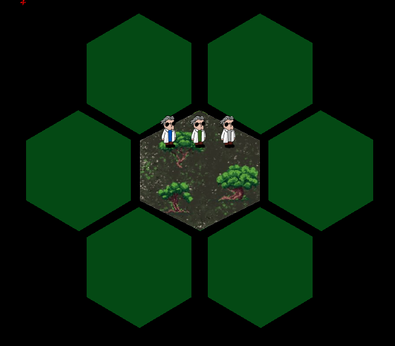

# Nem-funkcionális jellemzők vizsgálata

A játék indításakor a főmenü fogadja a játékost, itt a jobb alsó sarokban egy animált cicát láthatunk, amire kattintva a játékos megtekintheti a Segítség menüt. Ezt a lehetőséget a játék semmilyen módon nem jelzi a játékos felé, ami átláthatóság és használhatóság szempontjából hiba, ezt egy a játék stílusához illeszkedő animált felirattal oldottam meg.
Ehhez kapcsolódik még a Segítség menü végtelenszeri megnyitásának hibája, ezt is fontosnak tartottam, mert eltelítheti a képernyőt és idegesítő lehet a felhasználónak. Ezt a problémát is javítottam.

    
    

A játék közben problémát okozott a játék háttérszín és az üres pálya színének hasonlósága. Főleg alacsony fényerő melett, nehezen megkülönböztethető, az üres mező a háttérszíntől. Egy kontrasztosabb színt kiválasztva javítottam a problémát, közben a javítottam a (shotgun surgery) kódolási hibát is a szín lekérdezésével kapcsolatban.

    

Az utolsó hiba amit találtam, a játék végével váltható ki, ahol is a felugró értesítésre kattintva a játék teljesen bezáródik. Ez egy olyan esemény amelyre a felhasználó nem számít. Megoldás lehet a bezárás felirat, vagy hogy a program enm záródik be. Miven a játéknak nem érdeke, hogy a felhasználó bezárja, ezért azt a megoldást választottam, hogy a program visszatér a főmenübe a játék végével.

## Összefoglalás
A játékot a nem funkcionális jellemzői szerint teszteltem és próbáltam javítani a megtalált hibákat. Mivel a játék sok különböző lehetőséget kínál a játékmenet közben, ezért az összes lehetséges kimenet tesztelése hosszadalmas folyamat volt. Tesztelés során elsősorban a játékélményre, használhatóságra, átláthatóságra koncentráltam. Figyelembe vettem a játékos által elvárható működést, visszajelzéseket, és ezek hiányosságát, hibáját kerestem a szoftverben. Úgy gondolom sikerült pár olyan hibát felfedezni, amely valóban jobbá teszi a szoftvert. Ezen felül megtanultam módszereket amelyek segítik az ilyen jellegű tesztelést.