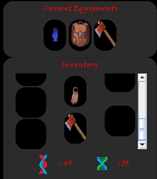
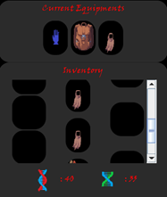
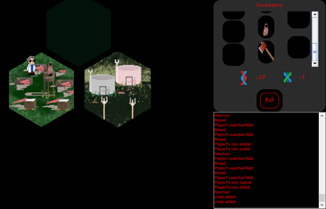
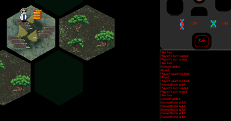
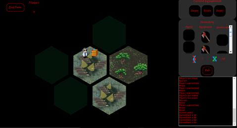

# Felszerelések használata, hozzátartozó férőhely megtelítése:
A játék szerint 5 helyünk van, a 4 különböző felszereléshez, ami több, mint elég. Ezeket végig próbálgattam, és mindegyik esetében megtehetjük, hogy felszereljük vagy levesszük magunkról. Képesek vagyunk egy elemből 1-nél többet is birtokolni, például sikerült 2 darab kabátot is felszednem. Így tehát lehetséges a tárhely megtelítése, mert a játék nem utasítja el a még egy ugyanolyan tárgy felvételét, mint amink már van. Ebben az esetben pedig, mikor megtelt mind az 5 férőhely, megpróbáltam egy kabátot felvenni. Erre a program reakciója, hogy nagyon helyesen nem vette fel, a pályáról nem tűnt el az elem ebben az esetben, az üzenet viszont az, hogy felvettük. Ezt az üzenetet többször is ki tudom váltani, így mind grafikailag, mind logikailag a pályán marad a kabát a program szerint, ez az elvárt működésnek megfelelő. Csupán az üzenet helytelen. (Másik megoldást jelenthet, ha nem hagyjuk csak egyféle tárgyból egyetlen darab felvételét, az viszont ebben az esetben egy bonyolultabb, szükségtelen módosítás. Viszont annak megvalósításakor is figyelni kéne a felvétel elutasítására és megfelelő kijelzésére a megfelelő szituációkban.) Ezt javítottam is, egy új üzenet hozzáadásával arra az esetre, ha már megtelt a férőhelyünk.

Sikeresen fel- és leszerelhetőek az eszközök, több egyforma tárgy felvehető

Megtelt férőhely esetén, félrevezető üzenet, de helyesen fel nem vett kabát

# Összetevők gyűjtéséhez maximális tárhely tesztelése:
Manuálisan teszteltem azt az eshetőséget, mikor az összetevőkből eltehető mennyiség határához érünk. Ehhez minél több anyagot próbáltam találni, és ezeket felszedni, míg meg nem telik a tárhely. Ekkor a program teljesen jól, üzenetet küld a felhasználónak, hogy nem vehet fel többet, és az okot is tudtára adja, hogy már megtelt a tárhelye. Így a játékos kétségek nélkül, egyértelműen tudhatja a játék állapotát, lépésének sikerességét. Eközben találkoztam véletlenül olyan esettel, de csak egyszer, mikor az anyagraktárra többször is rákattinthattam, az nem tűnt el, a lépéseim száma fogyott, az anyagmennyiségem viszont nem nőtt. Ezt az esetet többszöri alkalommal próbáltam reprodukálni, míg megtaláltam azt a speciális esetet, ami előidézi. Igazából arról van szó, hogy előfordul, hogy az anyagraktár nem törlődik, tartalma viszont átkerül, ami később mindenféle problémához vezet. (Valószínűleg egy loop-ba kerülve többször hozzáadódik a területről való törlés hiányában, mert mindig 40 körüli értékeket vehettünk fel, ez az alapértelmezett maximális érték.) A problémát kijavítottam, már ebben az esetben is eltűnik a kiürített anyagraktár, így funkcionálisan jól működik, nem okoz gondot ezen módon. 

Helyesen működő hibaüzenet, tele lévő tárhely esetében

Hibás működés anyagraktár kiürítésekor